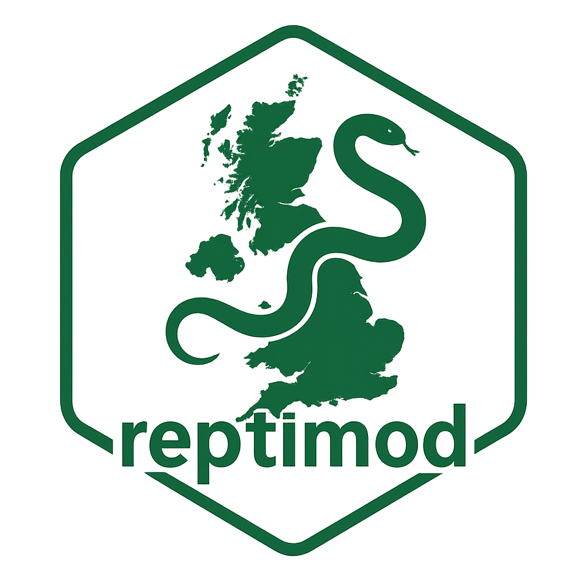

  

    <h1 style="margin:0; border:none;">reptimod</h1>
    

      Tools to build, fit, and evaluate integrated single- and multi-season  
      occupancy models for UK reptiles.
    

  

  

    
  

